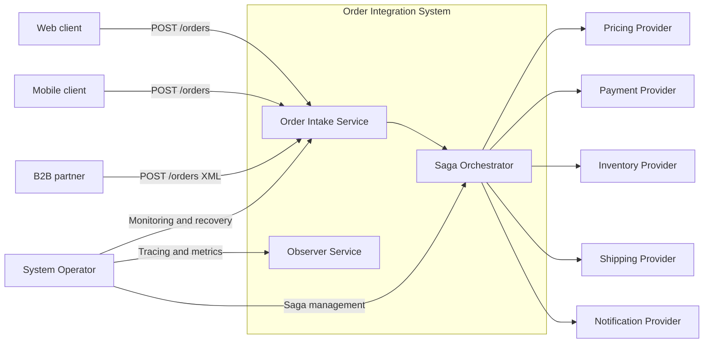
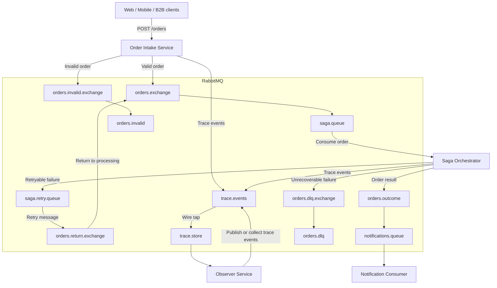

# Architecture

## System context

```mermaid
flowchart LR
    Web[Web client]
    Mobile[Mobile client]
    B2B[B2B partner]

    subgraph System[Order Integration System]
        Intake[Order Intake Service]
        Orchestrator[Saga Orchestrator]
        Observer[Observer Service]
    end

    Pricing[Pricing Provider]
    Payment[Payment Provider]
    Inventory[Inventory Provider]
    Shipping[Shipping Provider]
    Notification[Notification Provider]
    Operator[System Operator]

    Web -->|POST /orders| Intake
    Mobile -->|POST /orders| Intake
    B2B -->|POST /orders XML| Intake

    Intake --> Orchestrator
    Orchestrator --> Pricing
    Orchestrator --> Payment
    Orchestrator --> Inventory
    Orchestrator --> Shipping
    Orchestrator --> Notification

    Operator -->|Monitoring and recovery| Intake
    Operator -->|Saga management| Orchestrator
    Operator -->|Tracing and metrics| Observer
```

## Integration architecture

```mermaid
flowchart TD
    Clients[Web / Mobile / B2B clients]
    Intake[Order Intake Service]
    Orchestrator[Saga Orchestrator]
    Observer[Observer Service]
    Notifier[Notification Consumer]

    subgraph RabbitMQ[RabbitMQ]
        OrdersExchange[orders.exchange]
        SagaQueue[saga.queue]
        RetryQueue[saga.retry.queue]

        ReturnExchange[orders.return.exchange]

        OutcomeQueue[orders.outcome]
        NotificationsQueue[notifications.queue]

        TraceEvents[trace.events]
        TraceStore[trace.store]

        DLQExchange[orders.dlq.exchange]
        DLQ[orders.dlq]

        InvalidExchange[orders.invalid.exchange]
        InvalidQueue[orders.invalid]
    end

    Clients -->|POST /orders| Intake

    Intake -->|Valid order| OrdersExchange
    Intake -->|Invalid order| InvalidExchange
    InvalidExchange --> InvalidQueue

    OrdersExchange --> SagaQueue
    SagaQueue -->|Consume order| Orchestrator

    Orchestrator -->|Retryable failure| RetryQueue
    RetryQueue -->|Retry message| ReturnExchange
    ReturnExchange -->|Return to processing| OrdersExchange

    Orchestrator -->|Unrecoverable failure| DLQExchange
    DLQExchange --> DLQ

    Orchestrator -->|Order result| OutcomeQueue
    OutcomeQueue --> NotificationsQueue
    NotificationsQueue --> Notifier

    Intake -->|Trace events| TraceEvents
    Orchestrator -->|Trace events| TraceEvents
    Observer -->|Publish or collect trace events| TraceEvents
    TraceEvents -->|Wire tap| TraceStore
    TraceStore --> Observer
```

